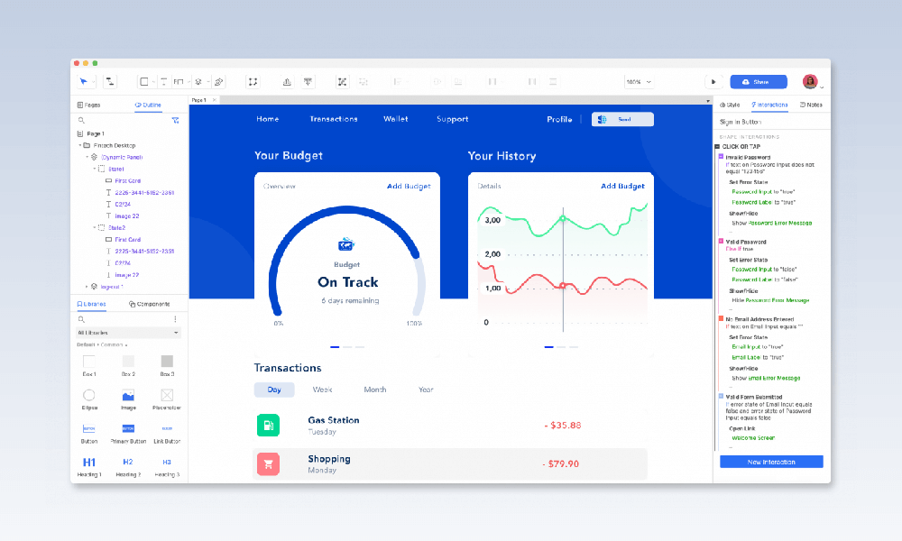
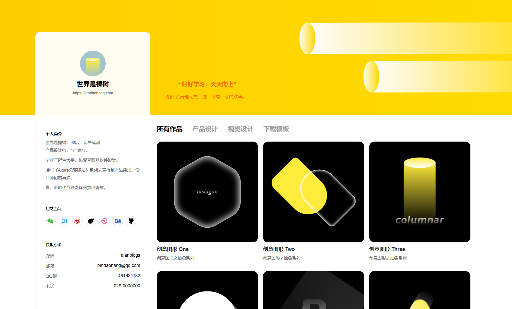
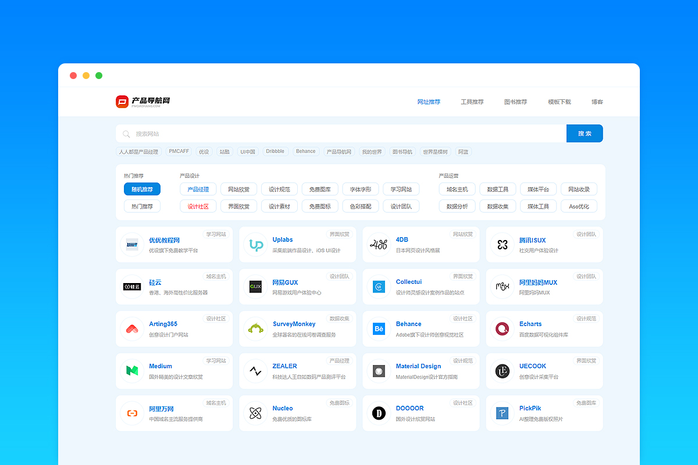
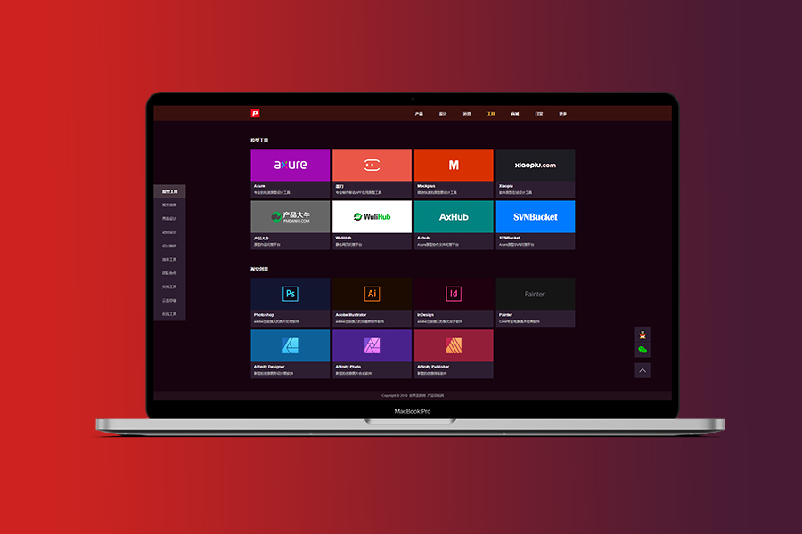

# Axure 建站指南

## 1.软件介绍
Axure 是一款原型设计软件，产品经理、UX设计师经常使用，原型设计后可以导出网站源文件，将源文件部署到网站托管云服务上，绑定自己的域名就可以做成静态个人网站。
 

 

## 2.适用场景

Axure 在设计原型上是迄今为止，可实现交互效果最强的原型设计软件，并且它支持JS API，可以使用JavaScript、jQuery来实现Axure本身功能实现不了的效果，所以可以设计出非常多惊艳的交互和视觉效果。

Axure 做的是静态网站，没有管理后台，也无法连接使用数据库，所以无法做到动态数据展示。

综合来看，Axure 可以设计独特美观的交互和视觉效果（取决于个人设计能力），展示内容固定的，不会频繁更新发布内容的网站，如**个人网站、企业官网、产品官网、活动网站、创意展示网站、导航网站**等各种静态网站。

 

## 3.网站案例

话不多说，有图才有真想，先看几个案例。
  

#### **3.1 个人网站《我的世界》，[点击预览 >>](https://my.pmdaohang.com/)**  

 

#### **3.2 个人网站《Be 博客》，[点击预览 >>](https://demo.pmdaohang.com/be/)**  

 

#### **3.3 导航网站《互联网导航》，[点击预览 >>](https://demo.pmdaohang.com/dh2/)**  

 

#### **3.4 导航网站《图书导航》，[点击预览 >>](https://demo.pmdaohang.com/tushu/)**  

 

#### **3.5 导航网站《产品导航网》，[点击预览 >>](https://demo.pmdaohang.com/dh/)**  

  

## 4.建站优势

 

#### ✒️ 4.1 自由的设计能力

Axure 强大的交互设计能力，JS API的支持，足以让你设计出绝大部分你能想到的惊艳效果。

 

#### 🚀 4.2 超快的建站速度

[ ✒️ 网站设计 > 🌏️ 网站部署 > 💻️网站上线 ]

你没看错，只需要两步，设计好你的网站原型，导出网站源文件部署到服务器就完成上线，完全不需要开发和测试，不会编程也毫无问题。

 

#### 💰️ 4.3 超低的建站成本

Axure 建站只需要两个费用，分别是域名和托管服务器，

你可以为自己购买一个喜欢的域名，.cn域名39元/年，.com域名69元/年，

网站可以托管在对象存储上，有些对象存储有免费的使用额度以及极低的资源使用费用，一般情况下免费资源足够使用。

当然如果你有云服务器，也可以将网站托管到服务器上，其它也有些免费的静态网站托管平台，可以免费托管，个人使用绰绰有余，后续会为大家推荐部分优秀的平台。

 

#### ⚡️ 4.4 超快的网站加载速度

Axure 导出的网站为静态网站，无需后端渲染，加载速度非常快。

 

#### 🌐 4.5 兼容主流浏览器

可以兼容谷歌、Edge、360、QQ、搜狗、Safari 等主流浏览器，🚫 不兼容IE浏览器。
  

## 5.开始建站第1步

如果你想拥有一个独特的，惊艳的个人网站，不妨尝试使用 Axure 建站，

如果你想，可以从下面的步骤开始：

 

#### 5.1 选择网站模板

在下方模板中选择并下载一个你喜欢的 Axure 网站模板，参照<a href="./007webdesign.html" target="_blank">《网站设计与配置》</a>，修改原型内容以及进行相关的配置。

[1.《我的世界》](https://my.pmdaohang.com/)

[2.《Be 博客》](https://demo.pmdaohang.com/be/)

[3.《互联网导航》](https://demo.pmdaohang.com/dh2/)

[4.《图书导航网站》](https://demo.pmdaohang.com/tushu/)

[5.《产品导航网》](https://demo.pmdaohang.com/dh/)

####  

#### 5.2 选购一个域名

参照<a href="./008yuming.html" target="_blank">《网站域名选购》</a>，选购一个你喜欢的域名。
  

#### 5.3 部署网站上线

选择下方任意一个平台，参照教程，部署网站。

1.<a href="./009oss.html" target="_blank">《阿里云OSS》</a>

2.<a href="./010cos.html" target="_blank">《腾讯云COS》</a>

 

👏👏  恭喜你，你的网站已经上线啦！

 

