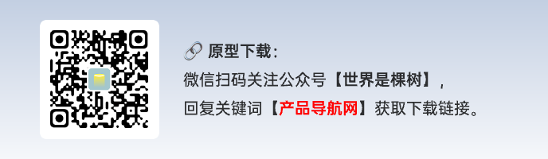
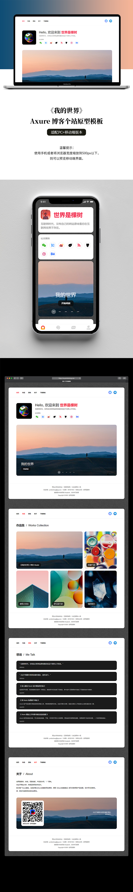
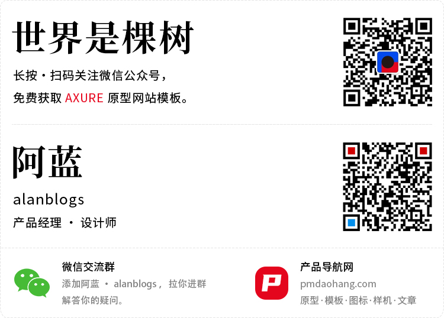

# Axure 原型模板：我的世界 V1.3

 

作品名称：我的世界

预览地址：https://my.pmdaohang.com

软件版本：Axure 8

**免费版（仅电脑端）下载地址：**

**付费版（含手机端）下载地址：** https://mbd.pub/o/bread/ZJqam5xv

 

**作品介绍：**

**我的世界**是一个Auxre 个人网站模板，由Axure RP 8.0 制作，可以使用此模板制作个人网站，模板的当前版本已经适配电脑端和手机端，

建议大家使用Axure8修改模板，不建议使用9及以上的软件版本修改模板，新软件在某些方面还不够成熟，可能出现意向不到的问题。

 

**更新记录：**

2021-03-13 V1.3 更新内容

1. 手机2倍屏幕高清适配，可以做到在2x、3x的手机屏幕高清浏览
2. 首页 Banner 增加鼠标和手势滑动切换

 

 

