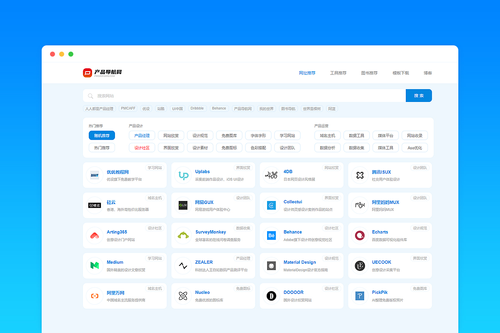
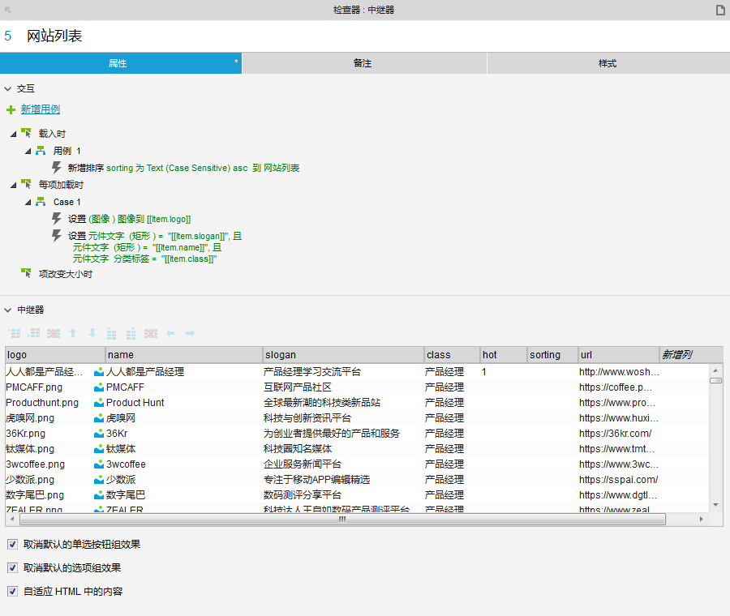
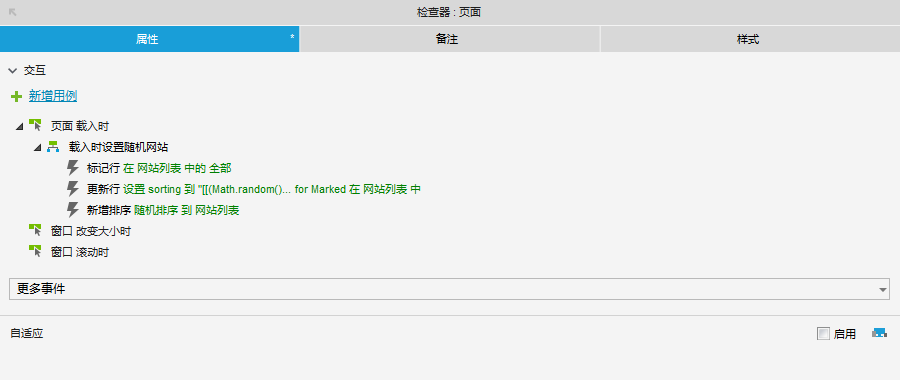
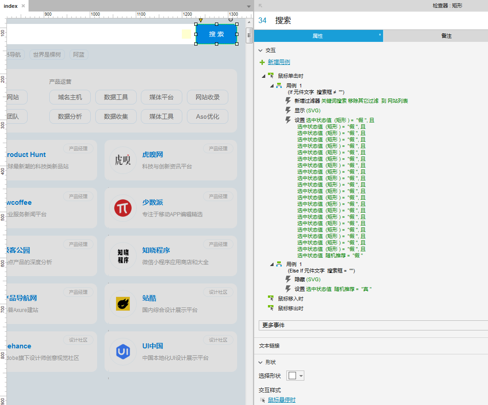
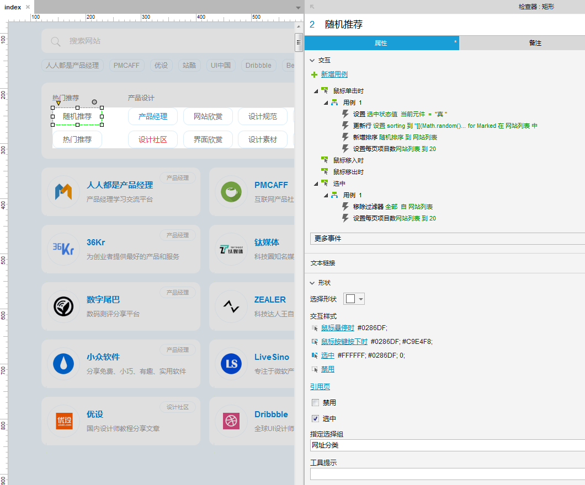
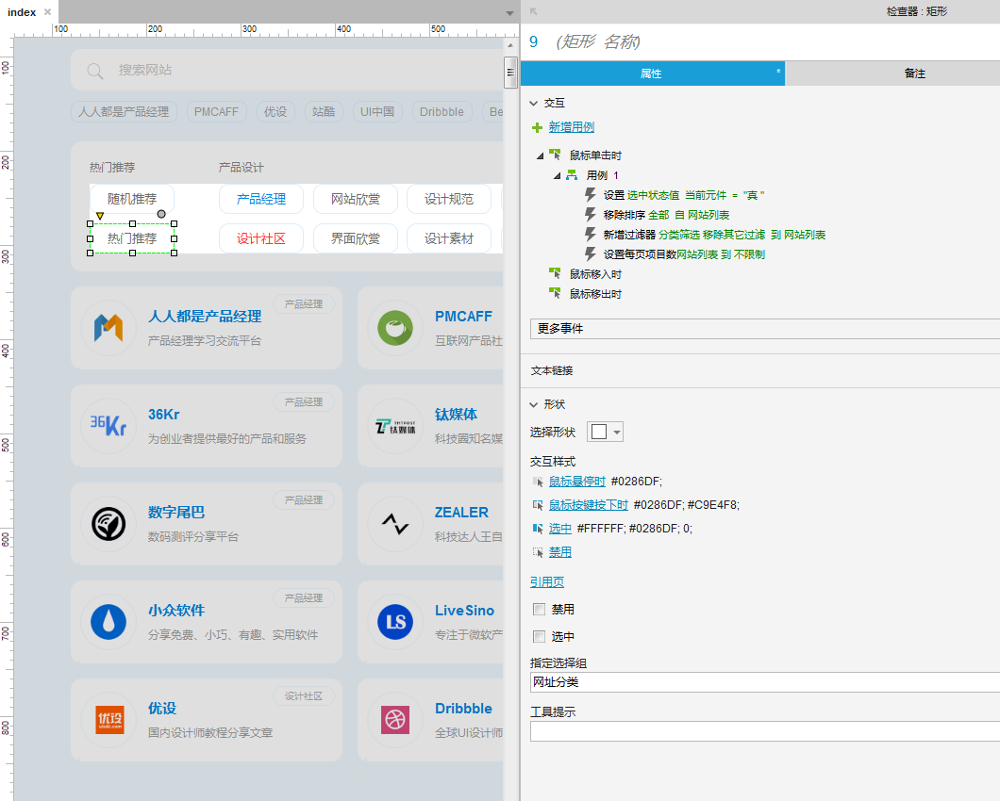
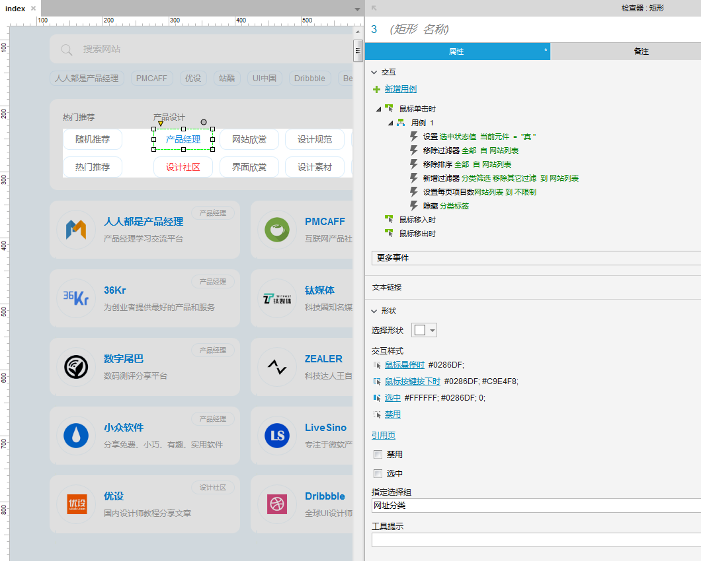

#  Axure 原型模板：互联网导航 V1.0

 

 

作品名称：互联网导航

预览地址：https://demo.pmdaohang.com/dh2

软件版本：Axure 8

**免费下载方式：**

 

这款《互联网导航》原型模板，包含了网址推荐、工具推荐、图书推荐几个模块，采用了相同的交互设计。

特意设计了随机推荐导航网站，在内容中加入一些别的内容，比如我在网址推荐中加入了红包奖励，当你刷到了，可以点击进入看到支付宝口令红包（仅演示，没有红包，哈哈），然后还放了其他几款模板的入口，让导航变得随机好玩一点。

这版导航整体就是做得比较简单，如果你想推荐其他行业的导航，模板有导航数据的Excel模板，按照模板修改或者直接修改中继器数据，多余的菜单和页面删除就行了，不用修改原型。

然后给大家讲下模板的一些交互设计逻辑，方便大家针对自己的需求进行修改。

 

## 原型设计逻辑

### 1.中继器：

中继器【网站列表】就是页面中展示网址的部分，相当于一个临时的数据表，可以存储简单的数据，为什么先介绍中继器呢，因为后面所有介绍的交互都在控制中继器来展示相应内容，所以先了解中继器，后面的内容更容理解。

**中继器定义了7个字段：**

- logo：导航网址的logo图片
- name：导航网址的名称
- slogan：导航网址的口号
- calss：导航网址的分类
- hot：热门推荐的标记字段
- sorting：排序字段值，这个在页面载入时和随机推荐时会赋值，所以中继器默认为空
- url：导航网址的网站地址

我在中继器【每项加在时】事件中设置了元件与中继器数据字段的对应关系，然后对应的元件展示的就是中继器的数据，这个比较基础，可以看下原型交互设置。

 

### 2.页面

当【页面载入时】，通过以下交互，就可以实现页面载入时随机推荐导航网址，每刷新一次网页，导航网址都会变化一次。

- 标记中继器【网站列表】全部内容（只有标记了，才会知道针对哪些数据进行操作）。
- 更新中继器【网站列表】排序字段【Sorting】的值为100万以内的随机数字，通过函数 [[(Math.random()*1000000).toFixed(0)]] ，来实现随机赋值。
- 增加中继器【网站列表】排序，让中继器数据按照排序字段【Sorting】值升序排列。

 

### 3.搜索

搜书输入框、搜索按钮：分别在【搜索输入框】的文字改变、键盘按键按下的事件，【搜索按钮】鼠标单击事件做了以下交互，就可以通过关键词模糊搜索导航。

- 当输入框文字为空时：自动选中“随机推荐”，然后激活随机交互按钮交互，显示随机推荐导航。
- 当输入框文字不为空时：给网址内容的中继器添加筛选条件，去搜索导航网址名称包含搜索关键词的导航，因为中继器默认搜索是全词匹配，只有一字不差的时候，才会筛选到，所以在中继器的筛选规则中，增加了模糊关键词搜索函数 [[Item.name.indexOf(name)!=-1]] ，可以实现只要导航名称中包含搜索关键词，就可以被搜索出来。

**搜索标签：**如“人人都是产品经理”，点击搜索标签时，会设置该标签名称到搜索输入框，然后自动激活搜索输入框的交互。

 

### 4.筛选栏

筛选栏的所有按钮，都设置成了一个选项组，所以筛选按钮都只能单选。

**随机推荐：**

- 鼠标单击事件交互：

  通过以下交互设置，可以重新对排序字段进行赋值，然后重新排列，并且限制每页显示数量，可以达到随机推荐20条数据的目的。

  - 设置【随机按钮】为选中状态
  - 更新【网站列表】中继器的排序字段【Sorting】的值为100万以内的随机数字，通过函数 [[(Math.random()*1000000).toFixed(0)]] ，来实现随机赋值。
  - 增加中继器【网站列表】排序，让中继器数据按照排序字段【Sorting】值升序排列
  - 设置中继器每页数据为20条

- **选中交互事件：**在选中事件中有1条移除筛选过滤器，这样才可以从搜索筛选或者其他筛选过来时，从所有的网址内容中进行随机推荐。

 

**热门推荐**：

在鼠标单击事件，通过以下交互设置，可以推荐中继器中定义为热门推荐的所有导航网站，如果你想定义哪个导航为热门推荐，只需要将中继器的【hot】字段值改为1就可以了。

- 设置当前元件（热门推荐）选中
- 移除所有中继器排序
- 新增中继器筛选，筛选条件是中继器热门字段【hot】值等于1
- 设置每页展示数据为不限制

 

**分类推荐：**

在如”产品经理”这些分类上设置了以下几条交互，就可以筛选出所选分类的导航内容。

- 设置当前元件（分类如”产品经理”）为选中状态
- 移除中继器所有筛选（清除筛选找到所有数据）
- 移除中继器所有排序（让数据按中继器数据顺序排序）
- 新增筛选，条件是中继器分类字段【class】值等于当前元件名称
- 设置每页展示数据为不限制（展示这个分类所有导航）
- 隐藏“分类标签”（在对应分类中，就不展示该分类标签名称了）

 

整个页面交互相对来说比较简单，网址推荐、工具推荐、图书推荐的所有交互都是一样的，只是改变了元件的排版和样式，如果没有特殊要求，你只需要修改中继器数据、网站标志、导航菜单，就可以做出自己的导航网站了。

 

 

