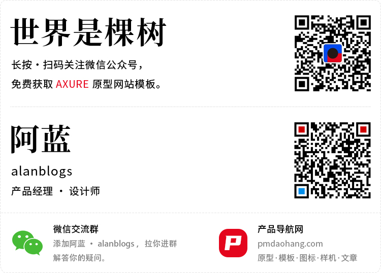

# Axure 原型模板：图书导航网站 V1.2

 

 

作品名称：图书导航

预览地址：https://demo.pmdaohang.com/tushu/

软件版本：Axure 9

**免费下载方式：**

 

大家好，这是2021新作品，为大家做的一个产品经理《图书导航》原型模板。

原型技巧：模板使用了中继器和随机函数，除了推荐产品经理阅读的图书，还使用随机函数对图书进行随机推荐，需要学习中继器和随机函数的朋友可以对原型进行拆解学习。

赚个小钱：图书导航链接结合了广告联盟，对图书链接做了CPS推广，将原型中的链接替换为自己的图书推广链接，你的朋友通过你的链接购买了图书，那么你可以获得一定的卖书分成佣金。

Tips：图书一般在京东平台买的比较多，大家可以在[**京东联盟**](https://union.jd.com/index)注册自己的账号，生成图书推广链接，替换原型中的链接。

 

**福利：扫码关注【世界是棵树】可免费获取图书导航原型和素材源文件，秘诀是关注公众号后悄悄回复”图书导航“，就可以获取下载链接了哈。**

 

 

**更新记录：**

2021-03-13 &nbsp;V1.2 更新

- 优化随机推荐按钮交互触发，删除右上角随机推荐按钮。
- 优化非随机推荐分类，按照预定顺序展示图书，方便查找。

2021.02.28 &nbsp;V1.1 发布

 

 

