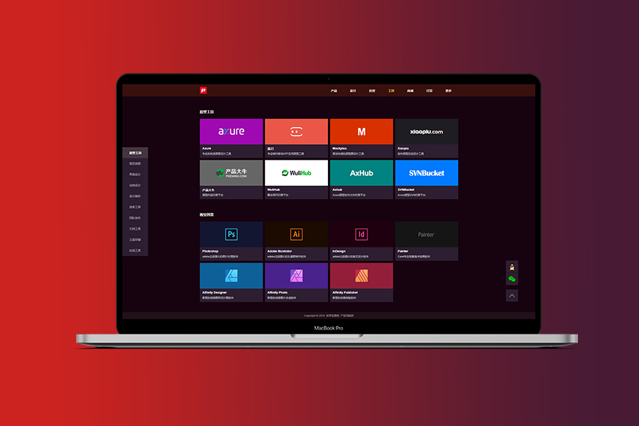

# Axure 原型模板：网址导航网站 V1.6

 

 

作品名称：产品导航网

预览地址：https://demo.pmdaohang.com/dh/

软件版本：Axure 8

**免费下载方式：**

 

产品导航网站原型模板，修改后可以创建自己的产品导航网站，免费下载。

 

## Axure 制作网站知识点

主要考虑到有些小伙伴对Axure一些功能点不是很熟悉，所以在此对本原型中用到的Axure功能做个简单介绍，方便小伙伴们修改产品导航原型内容

当然，以下的教程需要小伙伴对Axure有基础的使用，至少对Axure是熟悉的，如果是零基础新手，那么建议可以先看下面内容，如果看不懂，可以先学习下Axure，一般也就一周时间就学会了

产品导航的原型是使用Axure RP 8 制作的，为什么选择8不选9呢，是因为目前有些功能9还没有，特别是手机适配倍数放大的功能，9是没有的，导致手机屏幕适配效果不是很理想，所以大家要做手机屏幕适配，建议选择RP 8会更合适一点。

 

### 1.网址内容（中继器）

中继器类似于数据库的概念，可以重复中继器的内容，但是数据可以使用不同的内容

 

### 2.修改中继器内容

在画布中双击中继器元件，可进入中继器里，对中继器内容进行编辑

 

### 3.中继器数据内容

数据表格中的内容与画布中中继器的元件内容需要一一对应，类似数据库的字段，我这里设置了网站名称（name)、网址链接（link)、简介（jianjie）、图标（icon)字段，数据与画布内容元件通过交互设置“每项加载时”配置对应关系

 

### 4.交互设置

我们这里有2组文字，1组图像，所以在“每项加载时”我们设置了一组文字数据来源，一组图标数据来源，这个配置是为了在网页加载时，显示图标、网址名称、网址简介内容

设置文本值或图片值时，先选中对应元件，

然后点击"fx"图标，

然后点击界面中的"插入变量、属性、函数或运算符...",找到"中继器/数据集"下面的Item开头后面的对应字段，比如name，则是Item.name，然后点击确定，

此时就将网址名称对应到了数据表格的name字段，网页加载时，网址名称就会显示name字段对应的内容

 

### 5.设置超链接

设置超链接需要先进入中继器，我这里是设置的整块内容都可以点击跳转，所以我把整块建了分组，然后在分组上创建超链接，设置超链接依然是找到中继器对应的link字段，这样就会链接到中继器link字段下的地址

 

###  6.修改网址

如果你需要替换网址内容，或者修改网址的呈现方式，可以修改如图这部分数据内容，网址展示是按照表格的从上到下顺序依次展示的

 

### 7.侧边内容（动态面板）

针对导航内容多的页面，我做了一个侧边栏锚点链接快捷跳转，点击后可以快速定位到对应的导航网站分类上

固定动态面板：设置为横向左侧，垂直居中

 

滚动到元件：鼠标单击交互，配置动作元件选择对应分类的标题元件即可

 

### 8.QQ跳转

http://wpa.qq.com/msgrd?v=3&uin=524858791&site=qq&menu=yes

把标注的QQ号码修改成自己的QQ号，然后QQ图标链接到这个地址，访客就可以通过浏览器打开QQ与你聊天。

 

