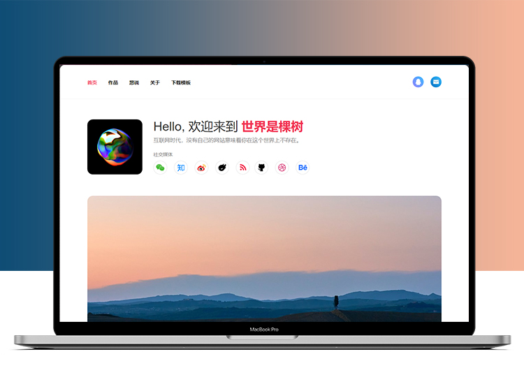

# Axure 网站设计与配置

## 1.网站设计

Axure 网站你可以按照自己的想法自行设计，或者选择我提供的网站原型模板进行修改。

## 2.网站配置

 

#### 2.1 Axure 预览工具栏删除

原型设计时，如果需要删除Axure预览时自带的左侧菜单和工具栏， 将原型的第1个页面名称命名为“index”，生成html后的网站就不会再显示工具栏了。

 

#### 2.2 保留简洁的网页访问地址

为了在访问时有更简洁的网页地址，建议原型设计时，原型页面的名称统一使用【英文】命名，中文命名会被转成一长串代码，不方便记忆。

 

#### 2.3 设置网页标题

网页在浏览器标签显示的网页名称也是可以修改的， 找到导出的网页（网页名称与我们原型页面是同名的），鼠标右键通过记事本打开，找到第4行代码title标签，两个标签中间的文字就是当前打开的网页标题名称，可以根据需求修改。

 

#### 2.4 配置网站 ico 图标

访问网站时，浏览器会显示网站的logo，这个logo我们可以在原型导出后，在网站文件的根目录放一个名称为“favicon.ico"的ico格式图标，图标格式可以在例如比特虫（[http://www.bitbug.net](http://www.bitbug.net/)）之类的网站转换。

 

 

