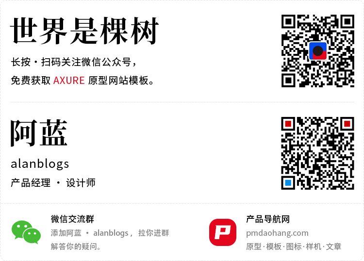

# Axure 网站托管：阿里云对象存储OSS

 

### 1.前言

**阿里云OSS部署有几个优点：**

免费：阿里云 OSS 香港区每月有5G免费存储空间和5G免费流量，一般的个人网站完全够用。

稳定：阿里云 OSS 部署的静态网站速度很快，也比较稳定。

免备案：阿里云OSS香港区可以绑定免备案域名，避免繁琐的备案流程。

如果你有自己的备案域名，且愿意每月花个几毛钱，也可以使用阿里云OSS境内区域进行部署，同时使用阿里云CDN进行境内加速，阿里云CDN可以设置封顶带宽，整套下来，网站的访问速度会更快，更加稳定。

 

### 2.原型网站部署视频

 

<iframe src="//player.bilibili.com/player.html?aid=852570183&bvid=BV1jL4y177bG&cid=557114667&page=1" scrolling="no" border="0" frameborder="no" framespacing="0" allowfullscreen="true" width="100%" height="600"> </iframe>

 

### 3.原型网站部署文字教程

那么，我开始以阿里云香港地区的OSS和CDN演示如何部署Axure原型静态网站。

 

#### 3.1 注册阿里云账号&域名

使用阿里云服务之前，你需要去[www.aliyun.com](http://www.aliyun.com/)注册一个账号，登录后进入控制台。

在阿里云万网，去购买一个自己喜欢的域名，然后我们开始进行网站部署。

 

#### 3.2 对象存储部署网站

1.进入阿里云控制台，在导航栏左侧汉堡菜单中找到“产品与服务”，然后搜索对象存储，进入对象存储管理界面。

 

2.在对象存储管理界面中创建新的Bucket，根据下图示例，进行填写和保存。

 

3.在 Bucket 列表，找到刚刚创建的 Bucket，点击进去后，找到【基础设置】-【静态页面】，然后如下图示例填写“默认首页”、“默认404页”，然后保存。

 

4.下载OSS客户端，OSS客户端可以很方便的上传文件+文件夹，不用像网页一样一个一个上传。

 

5.OSS客户端是绿色版软件，直接解压文件，点击文件夹中的启动图标，打开OSS客户端。

 

6.在阿里云，指向右上角自己头像，找到 【 AccessKey 管理】 ，进入授权秘钥管理。

 

7.新建一个授权秘钥，待会儿需要AccessKey ID 和 AccessKey Secret。

 

8.然后打开OSS客户端登录，把复制的AccessKey ID 和 AccessKey Secret填入OSS客户端对应的输入框，预设OSS路径填写在自己的 Bucket 名称（默认根目录），区域填写自己Bucket所属区域，然后登入。

 

9.在你的Bucket根目录，将你准备好的Axure html文件拖入OSS客户端，会自动上传，然后回到阿里云，进入后面的步骤操作。

 

10.在 Bucket 中找到【传输管理】-【域名管理】，点击绑定域名，然后输入你需要绑定的域名，如果你是在阿里云购买的域名，可以选中“自动添加 CNAME 记录“，阿里云会自动为你的域名添加解析。

如果你是在其他服务商购买的域名，需要在对象存储绑定域名后，自行去服务商添加域名解析记录，将CNAME指向对象存储的【外网访问-Bucket 域名】，该域名可以在 Bucket 的【概览】-【访问域名】中进行查看。

 

11.绑定成功后，接着可以托管SSL证书，让网站可以通过https访问，托管证书之前需要在阿里云申请证书，申请证书步骤可以在后面的“阿里云SSL证书申请”中按着教程申请完成后回来。

 

12.我们申请完SSL证书，下载文件，解压后会得到以下两个文件，后缀PEM的是公钥，后缀Key的是私钥，我们可以通过鼠标右键，打开方式选择记事本，打开这两个文件。

 

13.我们将PEM中的代码复制到公钥，Key中的代码复制到私钥，点击上传，就完成SSL证书托管了。

 

14.可以看到证书托管完成后的列表提示，可以访问域名，查看浏览器地址是否有小锁，是否通过https访问的。

 

#### 3.3 阿里云SSL证书申请

 

1.进入阿里云控制台，在导航栏左侧汉堡菜单中找到“产品与服务”，然后搜索SSL，进入SSL管理界面。

 

2.在SSL证书管理界面中，点击【购买证书】

 

3.按照下图示例选择一个免费证书进行购买

 

4.购买完成后，回到SSL管理界面，找到刚刚购买的证书，点击【证书申请】

 

5.然后按照下图示例填写，给你绑定在对象存储的域名申请SSL证书，如果你的域名在阿里云，就选择“自动DNS验证”，如果你的域名在其他服务商，就选择“手工DNS验证”，填写完成后点击下一步。

 

6.如果你是DNS自动验证，直接点击验证就可以验证成功。

如果是手工DNS验证，就按照阿里云提示，去你的域名服务商添加对应的DNS解析，DNS解析类型填写TXT，主机记录和记录值按如下图阿里云给出的值填写就可以了，然后回来点击验证，DNS解析生效需要一定时间，验证不成功，可以等两分钟再试。

注：截止2021-01-09日，阿里云改版，暂时没有了自动DNS验证方式，仅可使用手工DNS方式验证，阿里云也需要手动添加DNS记录，然后在证书申请中去验证。

验证成功后，点击提交审核，就可以了。

 

7.以前申请SSL证书，审核需要几分钟，但最近申请的SSL证书，发现审核都是秒过的，审核通过后可以点击下载证书。

 

8.我们证书用在阿里云对象存储，下载“其他”里的证书就可以了，下载后去对象存储托管证书。

 

#### 3.4 阿里云CDN加速网站

如果你的用户在国内，且你的域名已备案，建议加速区域选择“仅中国内地”，如果域名没备案，不建议用CDN，因为选择境外，从国内访问，速度非常慢。

因为我的域名没有备案，所以这里我使用境外加速进行演示。

 

1.在对象存储的域名管理中，点击阿里云CDN加速的【未配置】进入CDN的配置界面。

 

2.在CDN配置中，一般来说从OSS过去的，基本都是选好的，你可以按照下图所示进行配置，备案域名，加速区域选择“仅中国内地”，可以对国内访问进行加速，配置选好后，点击下一步。

 

3.创建成功后，在域名管理界面，复制CNAME地址。

 

4.在“产品与服务”中搜索DNS，进入【云解析DNS】

 

5.在域名解析中，找到自己绑定对象存储的域名，点击【解析设置】

 

6.在解析设置中，选择添加记录，记录类型选择CNAME，主机记录就是你绑定OSS的域名，如果主域名就输入@，如果二级域名就输入你的二级域名，记录值填写刚刚在对象存储中复制的CDN的CNAME地址，填好后点击保存。

 

7.然后回到对象存储的域名管理，看到CNAME的感叹号，变成绿色的√符号后，CDN域名解析就做好了，你就可以去访问绑定的域名，查看浏览效果了。

 

8.CDN有带宽封顶限制功能，如果担心消耗流量过高，可以开启该功能限制一下带宽，或者修改计费方式为按带宽计费的方式计算费用。

这次简单给大家讲下Axure 网站新的部署方式，希望大家有更稳定的个人网站。

 

