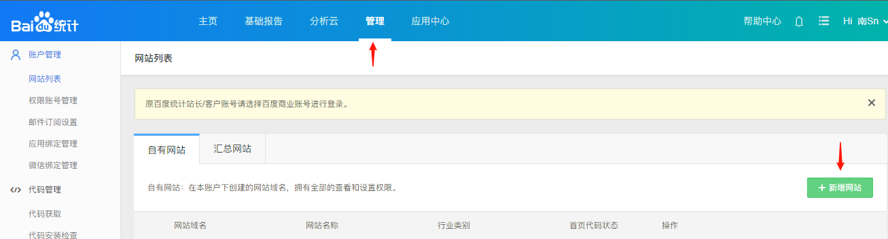
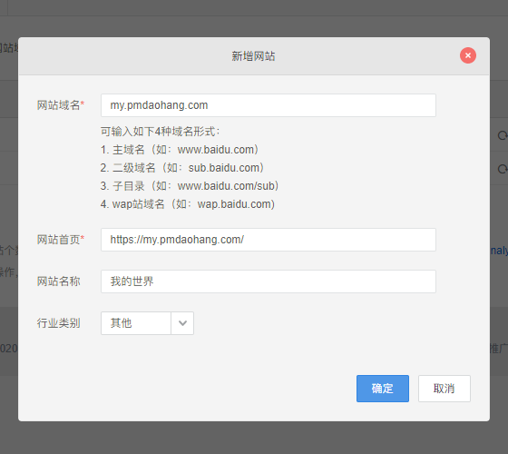
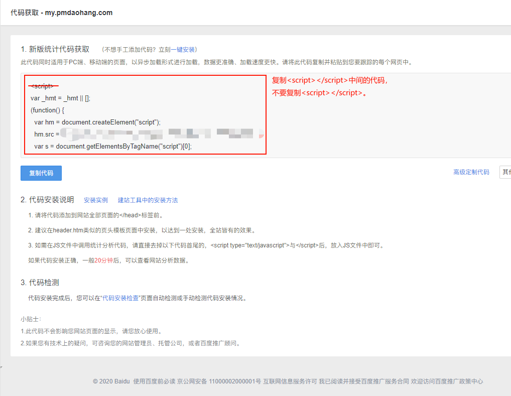
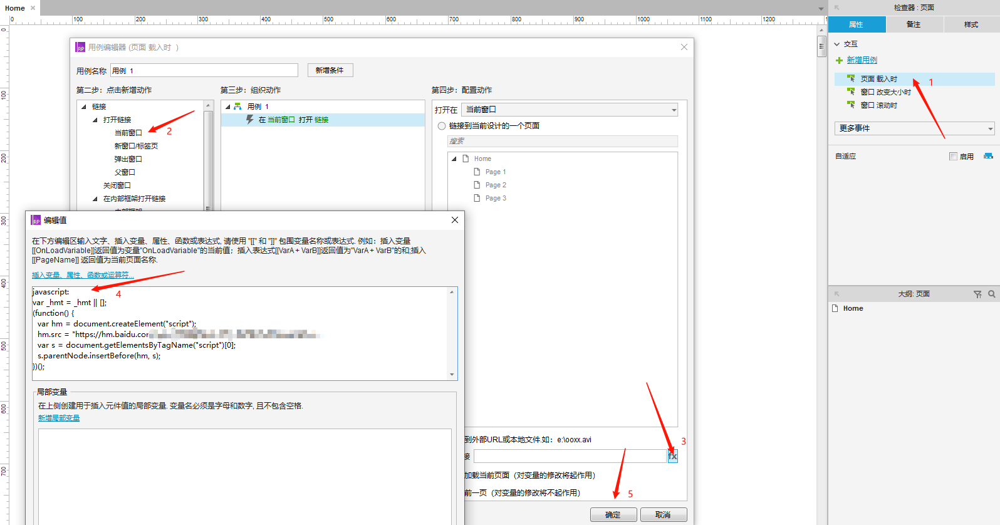
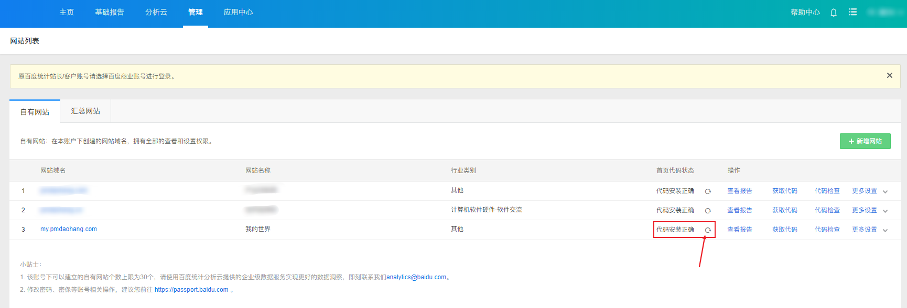

# Axure 网站使用百度统计查看流量

 

有读者在问Axure建的静态网站怎么统计流量，

那么我就给大家讲下如何使用百度统计来统计Axure网站的流量。

首页在百度统计注册一个账号，

https://tongji.baidu.com/

 

1.注册登录账号后，在管理中新增网站。

 

2.根据自己网站内容填写网站信息。

 

3.创建成功后，在代码获取中复制代码，复制的代码不要包含 script 开始和结束标签。

 

4.然后在Axure中如下图所示，设置页面载入时的交互，

注意，要在复制的代码前填写 "javascript:"，冒号注意使用英文符号，

网站的每个页面都需要设置，否则未设置的页面无法统计。

 

5.重新导出HTML文件，上传到Coding或服务器部署网站，

然后在百度统计管理列表中，【首页代码状态】栏点击【刷新小图标】，检测统计代码是否生效，

如果显示代码安装正确，则代码已正常安装。

 

6.然后点击【查看报告】，就可以看网站的流量统计情况。

 

