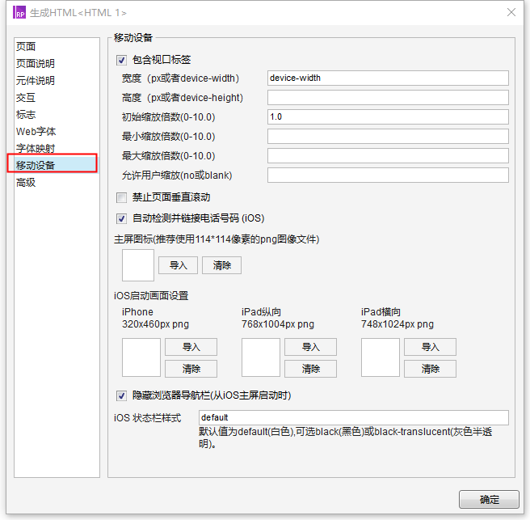

# Axure 9 移动设备自适应视图


虽然Axure9做了很多移动端的适配工作，移动端的设计体验也好了很多，

但是只是在PC端预览有移动端的效果，

在移动设备上浏览却没有自动适应屏幕的效果，而且也没有设置移动端的适配的入口。

而在Axure8中是有这个设置面板的，设置非常方便，如下：




那 Axure9 如何才能设置移动端适配呢，还是有办法的，只是需要稍微做一些处理。

1、找Axure 9软件安装目录里的axutils.js文件，路径一般为：【C:\Program Files (x86)\Axure\Axure RP 8\DefaultSettings\Prototype_Files\resources\scripts】。

<br>

2、用记事本打开这个axutils.js文件，在代码最前端加上以下代码。

```javascript
// 向页面注入meta标签
var oMeta = document.createElement('meta');
oMeta.name = 'viewport';
oMeta.content = 'width=375, minimum-scale=0.5, maximum-scale=3, user-scalable=no';
document.getElementsByTagName('head')[0].appendChild(oMeta);
```


<br>

3、保存后，重新预览页面或生成文件，就已经可以实现页面适配屏幕宽度了。

<br>

### 参数作用注释

代码里面加粗的部分各自代表是：

**width：宽度（px或者device-width）**

**minimum-scale：最小缩放倍数（0-10.0）**

**maximum-scale：最大缩放倍数（0-10.0）**

**user-scalable：允许用户缩放（no或blank）**

其他的部分，需要用到的时候往里加就行

**initila-scale：初始缩放倍数（0-10.0）**

**height：高度（px或者device-height）**


<br>

