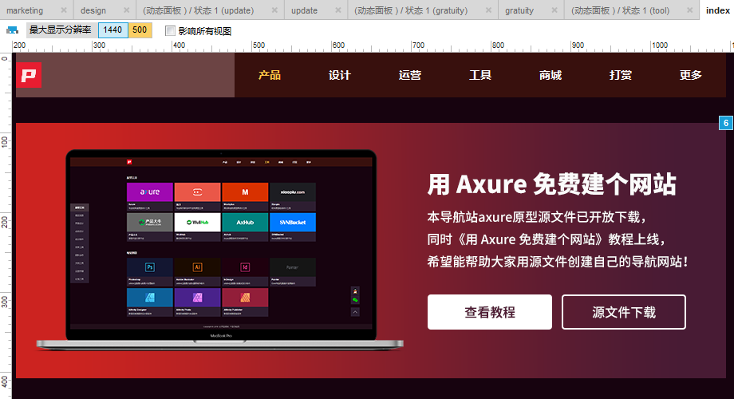

# Axure 建站之手机移动端自适应视图

Axure 自带自适应功能，可以自适应电脑、平板、手机等不同大小的屏幕，

要完成手机屏幕的适配，需要做两个地方的设置，

一个是页面自适应，一个是手机自适应。

### 1.页面自适应

那我们先聊页面自适应属性，页面自适应属性可以通过菜单栏"项目-自适应视图"中配置，

自适应视图的意思是，浏览器宽度、高度不同时，就显示条件匹配的视图页面内容，如电脑有些屏幕宽度为1920px、1280px等，手机屏幕宽度为375px，

在不同的屏幕宽度上，浏览器默认宽度则不同，或者你在电脑屏幕上疯狂拖拽浏览器窗口大小，浏览器则会根据宽度切换到该条件的视图进行显示，

当然，如果你只做了一种视图，那么不管你如何疯狂拖拽，网页内容是不会变化的，你会看见的是多出了纵向滚动条或者横向滚动条，仅此而已。

简单针对自适应视图设置中的几个属性进行解释：

**预设**：系统预设尺寸大小，可以快速填充后面几项设置数据。

**名称**：就是给视图取个名字。条件：触发该自适应视图的条件，浏览器窗口≥某宽度或≤某宽度。

**宽**：设置触发自适应视图宽度，如浏览器窗口小于1280px时，显示该视图的页面内容，手机我设置的宽度为500px，因为目前有些大屏手机，其实逻辑像素已经接近500px了，所以保险起见，设置小于500px则显示手机视图

**高**：一般不设置此项，留空，原理与宽度一个意思。

**继承自**：页面中的默认元素继承自哪个视图，继承的元素可删除，然后会在原来的视图依然存在。

 

特别解释一下“最大显示分辨率”，意思是超过最大的显示分辨率的屏幕，一律按照此视图内容显示网页内容。

 

自适应视图设置好后，就可以在不同大小页面去设计网页内容了。

 

生成HTML时，需要在菜单”发布-生成原型文件”的“自适应视图”中勾选自适应视图。

 

### 2.手机自适应

聊完页面自适应，再来聊聊手机自适应，

手机自适应在菜单”发布-生成原型文件”的“手机/移动设备”中进行设置，这里设置的是在手机网页中如何完美显示的问题，如果你不设置，那么可能你手机网页显示了网页内容，然后两边宽度留白很多，或者显示不完网页内容，

因为你在自适应视图中设计的宽度可能是375px，可能是414px宽度，但是手机的屏幕尺寸种类非常多，设计尺寸并不能完全适应所有手机屏幕，

那么为了不管哪种宽度，在手机网页上都需要满屏铺满网页才更美观，这里的设置就是干这事儿的。

简单针对手机自适应设置中的几个属性进行解释：

**包含视图接口标记**：勾选后，才会启用手机网页自适应屏幕大小。

**宽度**：【重要设置】此处宽度填写在手机的自适应视图中，设计图的基准尺寸，我使用的375px（iPhone 6s）基准进行设计的，所以这里我填写的是375的宽度。

**高度**：这里留空，无需填写。

**初始比例**：这里留空，无需填写，我试了试，这里不填写默认比例为1。

**最小比例**：【重要设置】这项作用是当用户使用比设计图更小的手机浏览网页时，可以等比缩放到手机屏幕宽度，这里设置的是最小值，我设置的0.5，足够使用了。

**最大比例**：【重要设置】原理与最小比例相同，使用比设计图更大的手机屏幕浏览网页时，自动等比放大到手机屏幕宽度，这里我设置的3，目前主流手机的最大屏幕宽度逻辑像素为480，设置3倍已足够使用。

**用户可调节**：填写no即可。

**防止垂直页面滚动（受阻弹性滚动）**：这项我试了几次，没明白有什么影响，可选可不选，大家也可以自己试试，如果知道什么意思，可以留言说一下。

**自动检测和链接电话号码（iOS)**：在iOS中，可以自动检测出电话号码，点击后，可以拨打电话，可选可不选，根据自己情况来吧。

**主屏幕图标**：主要是把网页设置到主屏幕时，显示的图标。iOS屏幕启动画面：网页放到桌面，打开后的启动画面，不多解释，不懂的，要拖出去打。

**隐藏浏览器导航（当从iOS主屏幕启动时）**：iOS打开放到桌面的网页，不会显示浏览器的导航栏和工具栏，比较适合预览APP应用的效果，勾上就行。

**iOS状态栏样式**：default（白底黑字儿），black（黑底白字儿），black(半透明的黑底白字儿)

 

没有具体的操作步骤，不过我想你看懂了这两处设置的每项参数含义，那么你已经学会了如何去做自适应网页和手机屏幕自适应了。

 

